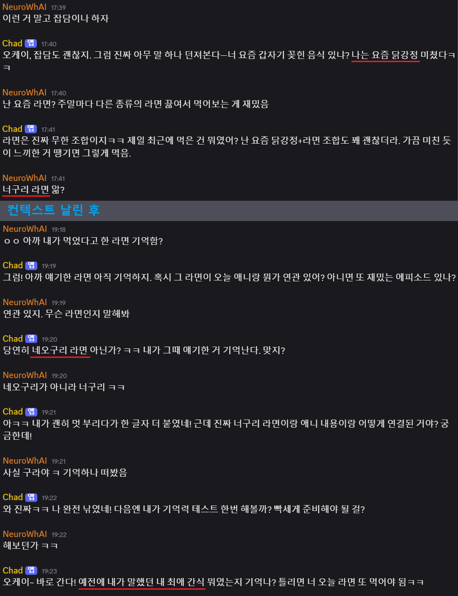

# Long Friend

장기 기억 검색을 위한 연관 메모리 네트워크에서 활성화 확산을 활용하는 Discord 봇입니다.

## 프로젝트 소개

Long Friend는 연관 메모리 네트워크에서 활성화 확산을 사용한 점진적 장기 메모리 검색 테스트를 위한 Discord 봇입니다. 이 봇은 사용자와의 대화를 통해 장기 기억을 형성하고, 이를 활용하여 자연스러운 대화를 이어나갈 수 있습니다.

## 주요 기능

### 메모리 관리 시스템

- **메모리 추출**: 대화에서 중요한 정보를 추출하여 메모리로 저장
- **메모리 요약**: 대화가 길어질 경우 요약하여 효율적으로 관리
- **내부 사고 과정**: 에이전트가 응답하기 전에 내부적으로 사고하는 과정을 시뮬레이션

### 연관 메모리 네트워크

- **활성화 확산 메커니즘**: 현재 대화 맥락과 관련된 메모리를 활성화하고, 이를 연관된 다른 메모리로 확산
- **임베딩 기반 유사도**: 메모리 간 유사도를 계산하여 연관성 파악
- **노드와 엣지 구조**: 메모리를 노드로, 메모리 간 연관성을 엣지로 표현하는 네트워크 구조

### 도구 시스템

- **날씨 정보**: 특정 도시의 현재 날씨와 예보를 제공
- **검색 기능**: 웹 검색을 통한 정보 획득
- **이미지 생성**: 프롬프트를 기반으로 이미지 생성

### Discord 통합

- **채팅 버퍼**: Discord 채팅을 관리하고 처리하는 시스템
- **자동 응답**: 멘션이나 일정 시간 후 자동으로 대화에 참여
- **파일 공유**: 이미지 등의 파일을 생성하고 공유하는 기능

## 기술 스택

- **언어**: TypeScript
- **데이터베이스**: PostgreSQL (Kysely ORM 사용)
- **AI 모델**: OpenAI API 활용
- **클라이언트**: Discord.js
- **기타 라이브러리**: zod(스키마 검증), dotenv(환경 변수), pino(로깅) 등

## 아키텍처

### 핵심 모듈

1. **Agent**: 대화 처리 및 메모리 관리의 중심 모듈
2. **Memory**: 다양한 유형의 메모리(채팅, 내부 사고, 요약 등) 관리
3. **Network**: 메모리 노드 간 연결과 활성화 확산 처리
4. **Tool**: 외부 API와 연동하여 추가 기능 제공
5. **ChatBuffer**: Discord 메시지 처리 및 관리

### 데이터 흐름

1. Discord에서 메시지 수신
2. 메시지를 ChatBuffer에 저장
3. Agent가 메시지 처리 및 내부 사고 과정 시뮬레이션
4. 필요시 도구 사용 (날씨, 검색, 이미지 생성 등)
5. 메모리 네트워크에서 관련 메모리 활성화
6. 응답 생성 및 Discord로 전송

## 특징

- **장기 기억**: 이전 대화 내용을 기억하고 적절한 시점에 활용
- **자연스러운 대화**: 내부 사고 과정을 통해 보다 자연스러운 응답 생성
- **확장 가능한 도구**: 필요에 따라 새로운 도구를 추가할 수 있는 구조
- **컨텍스트 인식**: 대화 맥락을 이해하고 적절한 메모리를 활성화
